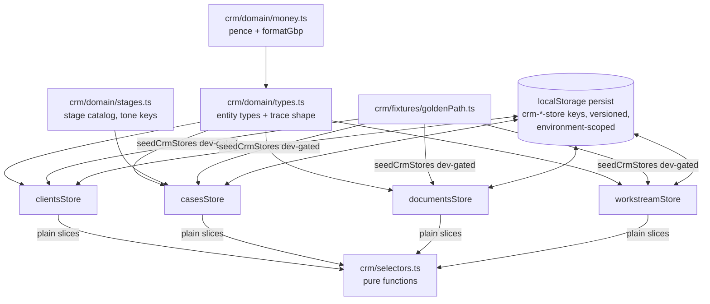

# Architecture: crm-domain-core

## TL;DR
- A pure, UI-less typed domain layer for the Lendmind mortgage CRM: entities, four persisted zustand stores, pure selectors, golden-path fixtures, and unit tests under a new `src/crm/`.
- Mirrors the house store idiom exactly (spaceStore/projectStore split, persist envelope + in-state schema version, environment scoping, microtask repair).
- One non-obvious choice: **money is integer pence (`number`), not `bigint`** — persisted stores JSON-serialize, and `JSON.stringify` throws on bigint (aionUsageStore's bigint is never persisted). `formatGbp()` lives beside the type.
- Stage/kind catalogs carry **semantic tone keys, never hex** — `scripts/check-design-token-usage.mjs` scans *all* of `src/`, not just UI.
- This layer is the substrate every later feature (F02–F17) builds on; it defines no UI, no routes, no edge calls.

## Inputs
- Recon: `.lm-flow/recon/eigent-codebase-map.md` + `.lm-flow/recon/lendmind-advisor-design-reference.md` (competitor recon skipped — the design export is our own reference)
- Brief: Typed CRM domain layer — Client, Case, Applicant join, fact-find field model with det/syn provenance, 8 pipeline stages, Document+insights, DocChecklist, Worklist, Stream entries with reasoning traces, Criteria, Product, Retention; stores + persistence + migrations; golden-path seed fixtures; selectors; unit tests; NO UI.
- Constraints:
  - Base branch `lendmind-crm`; PR targets `lendmind-crm`, never `main`.
  - Must pass existing gates: type-check, eslint, design-token usage (scans all src), no-legacy-backend (**never write the word "camel case" with a space — the `/camel/i` rule fails the build; only `camelCase` as one token is exempt**), no-dead-brain-calls (never name anything `fetchGet|uploadFile|...`), i18n parity (no locale keys added), vitest baseline (add passing tests only; do not fix baselined failures).
  - License header block required on every new `.ts` file.
  - No new deps (zustand, date-fns already present). No edge/API calls in this feature.

## Component diagram

## Components

### CrmDomainTypes
- **Responsibility:** Every CRM entity type and enum: `Client`, `Case`, `Applicant` (join: `{ clientId, role, profile, completeness }`), `FactFindField` (`{ k, label, v, t?, src: 'det'|'syn', hint?, flag?, conflict?, mono? }`), `FactFindSection` (`{ completeness, fields }`) keyed by `personal|contact|address|employment|income|expenditure|credit`, `CaseProperty`, `Deposit` (+breakdown w/ flags), `Requirement`, `Affordability`, `CrmDocument` + `DocInsight` (`{ label, value, conf, good?, flag?, conflict? }`), `DocChecklistItem` (`received|pending|partial|requested`), `WorklistItem` (kinds `conflict|criteria|doc|approval|retention|signature`, `auto?`), `StreamEntry` (kinds `live|intent|approval|conflict|external|done|blocked`) + `ReasoningTrace` (`{ claim, subject?, working[], evidence[{kind: criteria|field|document|policy|calc, label, value?, source?, quote?, note?}], alternatives?[], confidence, calibration? }`), `ActivityEvent`, `CriterionCheck` (`{ group: lending|affordability, cat, label, status: pass|warning|info, reasoning, impacts?[] }`), `Product` (+ solver extensions `rationale|criteriaTrail|rejectReason|rejectCriterion|failOn`), `RetentionEntry` (`case-open|due|horizon`).
- **Lives at:** `src/crm/domain/types.ts`
- **Mirrors:** `src/types/index.ts` leaf-module style (cross-cutting types); record shapes transcribed from design reference §3.
- **Depends on:** `crm/domain/money.ts`.
- **Surface:** exported types + `CRM_SCHEMA_VERSION = 1` (stamped on records, mirroring `SPACE_SCHEMA_VERSION`).

### StageCatalog
- **Responsibility:** The 8 pipeline stages `LEAD → FACT_FIND → SOURCING → DIP → APPLICATION → VALUATION → OFFER → COMPLETION` as `{ key, label, short, tone }` where `tone` is a semantic token name (e.g. `'status-pending'`, `'brand'`) — hex mapping happens in F02's UI layer.
- **Lives at:** `src/crm/domain/stages.ts`
- **Mirrors:** design reference §3.2; tone-key indirection is new ground because the design-token gate forbids hex anywhere in `src/`.
- **Surface:** `STAGES`, `STAGE_MAP`, `stageIndex()`, `nextStage()`.

### MoneyAndIds
- **Responsibility:** `Pence` branded number type, `formatGbp(pence, {compact?})`, `parseGbp`, plus id helpers `newCrmId(prefix)` composing `generateUniqueId()` (`client_…`, `case_…`, `doc_…`, `stream_…`).
- **Lives at:** `src/crm/domain/money.ts`, id helper inside `src/crm/domain/ids.ts`
- **Mirrors:** `aionUsageStore.formatMicroUsd` (integer minor units + formatter beside type) — but plain `number` pence, because these values persist through JSON.
- **Surface:** pure functions, no store.

### clientsStore
- **Responsibility:** Client records (durable identity across many cases): CRUD, `upsertClients`, `ensureClient`, case back-references.
- **Lives at:** `src/crm/clientsStore.ts`
- **Mirrors:** `src/store/spaceStore.ts` persisted anatomy (persist name `crm-clients-store`, `version: CRM_CLIENTS_PERSIST_VERSION = 1`, shape-repair `migrate`, explicit-allowlist `partialize`, `storageEnvironmentKey: getAuthEnvironmentKey()` checked in migrate + trailing `queueMicrotask` repair).
- **Surface:** `useCrmClientsStore`, `getCrmClientsStore()`, actions `upsertClients`, `removeClient`, `noteClientCase`.

### casesStore
- **Responsibility:** Cases + applicants join + per-applicant fact-find profiles. Field-level actions with provenance: `setFactFindField(caseId, clientId, section, field)` (records prior value into an audit note), `confirmSynthesizedField`, `resolveConflict(caseId, fieldKey, resolution)`, `recomputeCompleteness` (pure helper `computeSectionCompleteness` — fields present/total, weighted), `moveStage`.
- **Lives at:** `src/crm/casesStore.ts`
- **Mirrors:** `spaceStore` persistence + `projectStore` action richness; completeness math is a pure module-level function (testable without the store).
- **Depends on:** StageCatalog, CrmDomainTypes, clientsStore (import hook store, `.getState()` at call sites, one direction only).
- **Surface:** `useCrmCasesStore`, `getCrmCasesStore()`, pure `computeSectionCompleteness`, `computeCaseCompleteness`.

### documentsStore
- **Responsibility:** Person-scoped documents with insights + per-owner checklist. Actions: `addDocument` (status `PROCESSING`), `completeDocument` (type, attribution, insights), `confirmAttribution`, `setChecklistStatus`. Conflict insights do **not** auto-mutate fact find here — cross-entity propagation is a selector concern until F11 wires the real pipeline.
- **Lives at:** `src/crm/documentsStore.ts`
- **Mirrors:** persisted-store template; checklist model from design §3.7–3.8.
- **Surface:** `useCrmDocumentsStore`, `getCrmDocumentsStore()`.

### workstreamStore
- **Responsibility:** The case activity record: worklist items, stream entries (with traces), passive activity log, retention radar entries. Actions: `pushStreamEntry`, `resolveWorklistItem`, `upsertRetention`, `noteActivity`.
- **Lives at:** `src/crm/workstreamStore.ts`
- **Mirrors:** persisted-store template; stream/worklist shapes from design §3.9–3.11, §3.22.
- **Surface:** `useCrmWorkstreamStore`, `getCrmWorkstreamStore()`.

### selectors
- **Responsibility:** Pure cross-store derivations over plain slices: `selectNeedsYou(worklist)`, `selectPipelineCounts(cases)`, `selectOpenConflicts(cases, documents)`, `selectRetentionUrgency(entries, now)` (<90 days urgent), `selectCaseStreamSections(entries)` (LIVE / NEEDS YOU / DIRECTIVES / ACTIVITY ordering), `selectDetSynCounts(profile)`.
- **Lives at:** `src/crm/selectors.ts`
- **Mirrors:** `getVisibleProjectMetasForSpace` pure-function selector style; hook selectors with stable `EMPTY_*` constants where subscription is needed.

### fixtures + seed
- **Responsibility:** Faithful transcription of the design's golden path: clients aisha/daniel/tom, CASE_417 (full Aisha+Daniel profiles incl. Daniel's probation flags and the £38,500/£37,300 salary conflict), CASE_392 (Tom, self-employed, retention 79 days), 8 pipeline rows, 6 documents + insights, checklists, 6 worklist items, AI_DID activity, retention radar, 10 criteria checks, 5+9 products (2yr + 5yr solver universes incl. reject criteria cites), stream entries with full traces. Seed action `seedCrmGoldenPath()` hydrates all four stores only when empty and only behind a dev flag (mirrors `INITIAL_BLANK_SPACE_CREATED_FROM` idiom); fixtures are import-safe for tests.
- **Lives at:** `src/crm/fixtures/goldenPath.ts`, `src/crm/fixtures/seed.ts`
- **Mirrors:** `test/fixtures/` data style, but lives in `src/` because F02–F05 UI demos consume it at runtime.

## Data model changes
No SQL/IndexedDB. Four new localStorage persist envelopes: `crm-clients-store`, `crm-cases-store`, `crm-documents-store`, `crm-workstream-store` — each `version: 1`, shape-repair `migrate`, explicit `partialize` allowlist, environment-scoped via `getAuthEnvironmentKey()` (`src/lib/authEnvironment.ts`). Records stamped `schemaVersion: CRM_SCHEMA_VERSION`. Timestamps epoch-ms `number`. Money integer pence.

## External integrations
None. This feature makes zero network calls. (The structured-artifact ingest seam arrives in F07; wire types, when they come, get one-line aliases in `src/api/aion/v1/transport.ts` — never direct `gen/` imports.)

## Sync vs async boundary
Everything synchronous in-renderer. Only async surface: `queueMicrotask` post-hydration repair blocks (house idiom).

## Failure modes & how we handle them
- **Persisted-state corruption / partial writes** → `migrate` written as shape-repair (drop unknown records, refill defaults), plus microtask repair with `console.warn` describing what was pruned.
- **Auth environment switch** → environment key mismatch clears CRM state (same as spaceStore) — prevents cross-tenant bleed.
- **bigint in persisted state** → forbidden by design (pence as `number`); a unit test asserts `JSON.stringify` round-trips each store's partialized state.
- **localStorage quota** → fixtures are small (<200KB); stream entries are the growth vector — `workstreamStore` caps persisted stream entries per case (keep latest 200, prune in partialize) and notes the cap in a comment.
- **Schema evolution** → per-record `schemaVersion` + persist envelope version; migration test drives `persist.getOptions().migrate?.(fixture, 0)` directly.
- **Cross-store referential integrity** (case → clientId dangling) → selectors tolerate missing refs (return placeholder), `removeClient` refuses when cases reference it.

## Test strategy
- Unit (vitest, `test/unit/crm/` + co-located `src/crm/*.test.ts` for state-machine-heavy stores): store actions, completeness math, conflict resolution transitions, selectors, migration + partialize round-trips (via `persist.getOptions()`), seed idempotence, fixture integrity (c417 numbers match design: LTV 85%, LTI 2.95×, £242,250 loan).
- Reset idiom: `beforeEach` full `setState`; localStorage cleared globally by `test/setup.ts`.
- Baseline: additive only — target ~60–80 new passing tests; never touch baselined failing files.
- No e2e (no UI).

## Phasing

### Phase 1 — Types, stores, persistence
- Goal: `src/crm/` domain types, stage catalog, money/ids, four persisted stores with migrations + environment scoping, pure completeness math, all unit-tested.
- Success criterion: `pnpm type-check && pnpm lint && pnpm test` green with ≥40 new passing tests covering every store action and the persist round-trip.

### Phase 2 — Selectors, fixtures, seed
- Goal: cross-store selectors, faithful golden-path fixtures (c417/c392/pipeline/worklist/criteria/products/stream traces), dev-gated seed, referential-integrity guards.
- Success criterion: `seedCrmGoldenPath()` hydrates all stores; fixture-integrity tests assert the design's headline numbers; selectors return the design's Today-screen counts (6 needs-you items, 4 activity rows, 4 retention entries) from seeded state.

## Open questions for the spec phase
- Exact fact-find field keys per section (spec must enumerate all — design reference §3.4 is the source).
- Worklist item lifecycle: resolved items — deleted or retained with status for audit?
- Stream entry cap (200/case proposed) — confirm and make it a named constant.
- Should seed auto-run in dev builds or require an explicit action (proposal: explicit action, wired to a debug affordance in F02)?
- Naming: `src/crm/` directory name and `Crm*` prefix vs `Lendmind*` (proposal: `crm`).

## Evidence
- `.lm-flow/recon/eigent-codebase-map.md` (engine map)
- `.lm-flow/recon/lendmind-advisor-design-reference.md` §3 (domain model), §5 (AI patterns)
- Store-conventions deep-dive (agent report, 2026-08-20): persisted-store anatomy (`spaceStore.ts:764-801`), two-version idiom, microtask repair, test idioms (`persist.getOptions()` assertions, `vi.hoisted`), gate hazards (`/camel/i`, design-token scan over all src, dead-brain identifier list, vitest baseline add-only, license headers). Coverage: recon docs + one focused agent (entry-points/infra passes already covered by codebase map).
