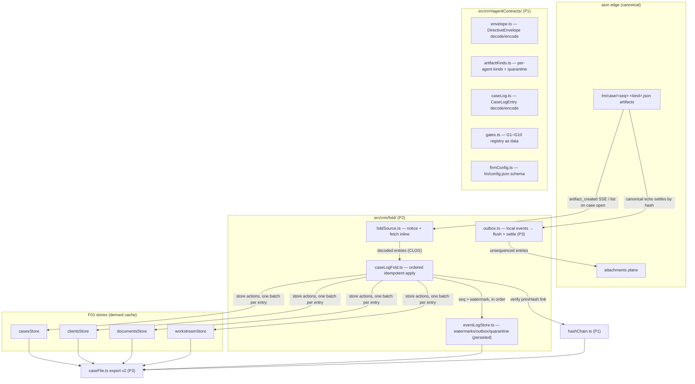

# Architecture: mesh-m1-contracts-audit-spine

## TL;DR
- M1 builds the **contract layer and audit spine** of the agent mesh: typed agent contracts (`src/crm/agentContracts/`), the **artifact-canonical event-log fold** (`lm/case/` artifacts → the four F01 stores as a derived cache), a content-hash chain, the gate registry G1–G10 as data, and per-firm config schema.
- **No UI, no new endpoints, no new dependencies.** Everything composes existing seams: the artifacts plane (list/read/subscribe), the attachments plane (outbox flush carrier), and F01 store actions.
- The one non-obvious design choice: contracts use the **house decode pattern** (`src/api/aion/v1/contracts.ts` style: hand-written types + `decode*`/`is*` pairs + open-set kinds), **not zod** — the spec's "zod" line is a recorded deviation; open-set typing IS the unknown-major quarantine mechanism.
- The fold mirrors the seven invariants of `src/api/aion/v1/reducer.ts` (pure `(state, event)`, decimal-string watermark compared via BigInt, referential-identity no-op on replay, unconditional cursor advance, record-never-repair, open sets, version-derived-not-folded) — with one deliberate deviation: our fold must consume entry **content**, so it is two-stage (notice metadata → fetch inline → apply strictly in per-case seq order).
- Surviving F01 review findings (atomic apply, loud failure paths) land **in the fold layer's design**, and the parked fix branch is merged as M1's first implementation task.

## Inputs
- Recon: `.lm-flow/recon/eigent-codebase-map.md` (project-level) + three parallel codebase reports (Evidence below)
- Brief: Spec v2 §12 M1 (`.lm-flow/spec/lendmind-agent-mesh-spec-v2.md`) — contracts + directive/artifact schemas + audit spine, extends F01
- Constraints:
  - Base branch `lendmind-crm`; never touch `main`
  - Do NOT modify `src/api/aion/v1/**` (generated client + house core; reducer changes have repo-wide blast radius) — the fold subscribes at the `aionArtifactsStore` level instead
  - No new npm dependencies; renderer hashing via `crypto.subtle` (WebCrypto)
  - ESLint FR-014 store-layering gate: fold sits downstream of all four stores (unrestricted imports); any upstream→downstream write goes through `_bus.ts`
  - Every new persisted store follows the full house checklist: `storageEnvironmentKey` + `getAuthEnvironmentKey()`, `migrate` with shape repair, `partialize`, `resetForTests`, exported `*_STORE_KEY`/`*_PERSIST_VERSION`, key added to `CRM_LS_KEYS` + `clearAllCrmState()`
  - `fix/crm-review-iter1` (worktree `/Users/singhvib/Documents/eigent-crm-domain-core`, commit with 15 files) must be merged + regression-tested as task 1

## Component diagram

## Components

### agentContracts (package)
- **Responsibility:** single source of truth for every cross-boundary shape: directive envelope, per-agent artifact kinds, case-log entries, gates, firm config, typed failures.
- **Lives at:** `src/crm/agentContracts/` — `envelope.ts`, `artifactKinds.ts`, `caseLog.ts`, `gates.ts`, `firmConfig.ts`, `failure.ts`, `index.ts` (new module).
- **Mirrors:** `src/api/aion/v1/contracts.ts` — `interface X extends Record<string, unknown>`, imperative required-field check, `decodeX(value: unknown): X` (throws typed `ContractDecodeError`), `parseXJSON`, `encodeX`, `isKnownXKind` predicates, **open-set kind typing** `KnownKind | (string & {})`.
- **Depends on:** `domain/types.ts` (F01 entities referenced by payloads), nothing else.
- **Surface:**
  - `DirectiveEnvelope` (`kind: 'lm.directive/1'`, `agent`, `caseId`, `directive`, `inputs {factFindDigest, artifacts[]}`, `constraints`, `issuedBy {kind: 'adviser'|'watcher'|'schedule', id}`, `gatePolicy`, `traceId`, **`attemptNonce`**, **`versions {model, promptSha, skillSemver, skillSha}`**, **`budgetMicroGbp`**) + decode/encode. Idempotency key = sha256(canonical envelope) — matches the edge's `command_id`-as-`Idempotency-Key` discipline (`transport.ts:198-202`).
  - Artifact kind registry: `lm.onboarding.request/1`, `lm.watcher.decision/1`, `lm.docintel.extraction/1`, `lm.sourcing.snapshot/1`, `lm.criteria.verdicts/1`, `lm.affordability.model/1`, `lm.comms.draft/1`, `lm.admin.chase/1`, `lm.failure/1` — each a decode + type predicate; `classifyKind(kind) → {family, major}` where an unrecognised **major** routes to quarantine (never throw, never drop — house open-set rule).
  - `CaseLogEntry` (`kind: 'lm.caselog/1'`, `caseId`, `seq` **decimal string**, `at`, `actor`, `event` — a discriminated union mirroring F01 write paths: `field-change | activity | stream-entry | worklist-upsert | worklist-resolve | conflict-upsert | conflict-resolve | checklist-status | stage-transition | case-upsert | client-upsert | document-upsert`, `origin {artifactId, runId}`, `versions`, `prevHash`, `hash`).
  - `GATE_REGISTRY: GateDescriptor[]` — G1–G10 as data (`id, name, approver: 'adviser'|'delegate-ok'|'network-supervisor', regulated, batchable, autoDisarmFlags[], basis`), per spec v2 §5. Pure data + lookup helpers; consumed by M2's approval cards and skills.
  - `FirmConfig` (`lm/config.json`): adapters, lender panel, fee model, disclosure text refs, chase cadences, delegation roster, quiet hours, breaker/budget caps + decode with per-field defaults.
- Contract surfaces also land as `.d.ts` under `specs/002-mesh-m1-contracts-audit-spine/contracts/` (house convention).

### hashChain
- **Responsibility:** tamper-evident content-hash chain over case-log entries; the audit primitive.
- **Lives at:** `src/crm/hashChain.ts` (new file).
- **Mirrors:** the edge's own convention — "Hex sha256 of the canonical document (the dedup key)" (`gen/edge-api.ts:1728`); canonicalisation **reuses `canonicalise()` from `caseFile.ts`** (promote to barrel export), hashing via `crypto.subtle.digest('SHA-256', …)` per `src/lib/oauth.ts:246` precedent.
- **Depends on:** `caseFile.ts#canonicalise`. Async by nature (WebCrypto) — all call sites are already async (artifact fetch, outbox enqueue).
- **Surface:** `sha256HexCanonical(value): Promise<string>`, `computeEntryHash(entry omit hash)`, `verifyChain(entries): Promise<{ok: true} | {ok: false, brokenAtSeq}>`.

### eventLogStore (fifth persisted store)
- **Responsibility:** fold bookkeeping that must survive restart: per-case applied watermark, pending out-of-order buffer, quarantine records, outbox queue.
- **Lives at:** `src/crm/fold/eventLogStore.ts`, localStorage key **`crm-eventlog-store`**.
- **Mirrors:** the four F01 stores' persist config verbatim (`casesStore.ts:674-701` pattern) — env-key guard, migrate + shape repair, partialize, resetForTests. Key added to `CRM_LS_KEYS`, `clearAllCrmState()`, `reset.test.ts`.
- **Depends on:** `agentContracts/caseLog`, `authEnvironment`.
- **Surface:** `watermarks: Record<CaseId, string>` (decimal-string seq), `pendingByCase`, `quarantine: QuarantineRecord[]` (capped, count surfaced), `outbox: OutboxRecord[]` (**never evicted while unflushed** — over-quota → refuse new local writes with typed refusal + worklist item, loud), actions `advanceWatermark`, `bufferPending`, `quarantineEntry`, `enqueueOutbox`, `settleOutbox(hash)`.

### caseLogFold
- **Responsibility:** ordered, idempotent, atomic application of decoded `CaseLogEntry`s to the four F01 stores.
- **Lives at:** `src/crm/fold/caseLogFold.ts`.
- **Mirrors:** `src/api/aion/v1/reducer.ts` (:435-486) — with the discipline transposed: `seq <= watermark` → **return without any setState** (replay invisible); apply strictly in seq order (buffer ahead-of-order entries; a gap that persists past the next refresh raises a `kind:'system'` worklist item — **record, surface, never skip**); unknown event union member → quarantine + advance (open set); copy-on-write via existing store actions.
- **Atomicity (folds review finding #2's lesson):** decode + precompute EVERYTHING for an entry first, then apply as one batch — one `setState` per touched store per entry, side-effects derived from observable state so a re-run finishes rather than no-ops.
- **Loudness (folds review finding #3's lesson):** the fold is downstream of all four stores (ESLint layering permits direct imports — no bus needed); every non-applied entry is *observable* (quarantine record, worklist item, or console.warn `[caseLogFold]`), never a silent drop.
- **Hash discipline:** verify `prevHash` linkage on apply; a chain break **halts the fold for that case** and raises a critical worklist item (audit integrity is the product).
- **Depends on:** all four stores (actions only), eventLogStore, hashChain, agentContracts.
- **Surface:** `foldEntries(caseId, entries): Promise<FoldReport>`, `foldReportForCase(caseId)`.

### foldSource
- **Responsibility:** notice and fetch `lm/case/` artifacts, decode, hand ordered batches to the fold.
- **Lives at:** `src/crm/fold/foldSource.ts`.
- **Mirrors:** the artifacts-plane read pattern — `loadAionArtifacts` (paginated list), `readAionArtifact(?inline=true)` (entries are small JSON, well under the 1 MiB inline cap), `subscribeAionArtifacts` for live notification (`aionArtifactsStore.ts` — event-driven, no polling).
- **Triggers:** (a) case opened → full list + fold from watermark; (b) live `subscribeAionArtifacts` notification during a run; (c) explicit refresh. **Known gap, by design:** with no live session there is no push channel (bindings are only minted by `startAionTask`) — the M2 watcher becomes the real-time driver; M1 is read-on-open + live-during-run.
- **Depends on:** `aionArtifactsStore`, agentContracts, caseLogFold.
- **Surface:** `refreshCaseLog(caseId)`, `attachCaseLogLiveSource(projectId, caseId)`, `detachCaseLogLiveSource`.

### outbox (P3)
- **Responsibility:** desktop-originated events (adviser edits) recorded as unsequenced, locally-hash-chained CaseLogEntry candidates and flushed upstream; settled when the canonical echo arrives.
- **Lives at:** `src/crm/fold/outbox.ts`.
- **Mirrors:** `browserDelegationExecutor.ts` — serialized drain, exactly-once semantics via completed-LRU; flush carrier is the **attachments plane** (`POST /projects/{id}/attachments`, 3 MiB cap, CAS-deduped — dedupe is free because our content hash IS the CAS key input).
- **Settle:** canonical `lm/case/` entry whose content hash matches an outbox record → `settleOutbox(hash)`; the store mutation already applied locally, so the fold marks it applied without re-applying (dedupe-by-hash extends the watermark discipline).
- **Two-writer note:** canonical `seq` is authored ONLY by the log writer (M2 watcher); the desktop never mints seq. M1 ships write + flush + settle with a simulated echo in tests; live end-to-end lands with M2.
- **Depends on:** eventLogStore, hashChain, `transport.ts#createAttachment`, `_bus.ts` (a new `EventLogSideBus` so `casesStore.setFactFindField`/etc. can enqueue without violating the layering gate).
- **Surface:** `recordLocalEvent(entryCandidate)`, `flushOutbox(projectId)`, `outboxDepth()`.

### caseFile export v2 (P3)
- **Responsibility:** regulator/SAR-shaped export with audit envelope.
- **Lives at:** extends `src/crm/caseFile.ts`.
- **Mirrors:** existing `CaseFileExport` (envelope `exportVersion: 1` literal) — v2 adds `exportVersion: 2`, `hashChainHead`, `chainVerified`, `artifactManifest [{name, artifactId, version, sha256}]`, `versionsStamp`, plus records: `caseLogEntries`, `outboxUnflushed`, `quarantine`. `importCaseFile` accepts **both** versions (v1 imports get `chainVerified: null`).
- **Depends on:** eventLogStore, hashChain, all four stores.

## Data model changes
No database (repo has none — zustand→localStorage only). Changes:
- New persisted store `crm-eventlog-store` v1 (house checklist above).
- `domain/ids.ts`: add `'outbox' | 'quarantine'` to `CrmIdPrefix`.
- `domain/types.ts`: additive optional `origin?: Origin` on `ActivityEvent` (the one entity missing it); `CRM_SCHEMA_VERSION` stays 1 (additive-optional is non-breaking; shape-repair already tolerates it).
- `caseFile.ts`: `CaseFileExportV2` types; `CRM_LS_KEYS` gains the new key.

## External integrations
| Provider | Auth | Endpoints we call | Events we consume | Limits to respect |
|---|---|---|---|---|
| aion edge (existing, only integration) | bearer edge API key (existing resolution) | `GET /projects/{id}/artifacts` (paginated, `?name=` exact-match only — prefix filter is client-side), `GET .../artifacts/{artifactId}?inline=true`, `POST /projects/{id}/attachments` | `artifact_created` via the existing SSE fold → `subscribeAionArtifacts` | inline read ≤ 1 MiB all-or-nothing (`content_truncated` → typed failure + worklist, fallback to grant download is M2); attachments ≤ 3 MiB; artifact listing paginated — fold source pages fully before ordering; idempotency keys on attachment POSTs |

No third-party integrations in M1. No new endpoints are requested from the edge team.

## Sync vs async boundary
- **Sync:** fold apply per entry (store actions), watermark advance, quarantine writes.
- **Async:** artifact list/fetch (on case open, on live notification, on refresh — never `setInterval`; event-driven invalidation is the house rule), hash computation (WebCrypto), outbox flush (serialized drain, `browserDelegationExecutor` pattern).
- **Deferred:** post-hydration reconciliation via the `queueMicrotask` idiom (`integrity.ts:273` precedent) — after stores hydrate, refold any pending buffer.

## Failure modes & handling
| Mode | Handling |
|---|---|
| Seq gap persists past next refresh | Loud: `kind:'system'` worklist item + fold halted at gap for that case; entries buffered, never skipped (record-never-repair) |
| Hash-chain break | Critical worklist item, fold halted for that case; export marks `chainVerified: false` |
| Unknown artifact/event major | Quarantine record (full payload retained), watermark advances, count surfaced — never dropped, never thrown |
| Duplicate seq (writer bug) | First-wins; anomaly counter + worklist item (mirror `gapCount` discipline) |
| `content_truncated` on inline read | Typed failure + worklist item (entry >1 MiB is itself a contract violation worth surfacing) |
| localStorage quota / outbox growth | Quarantine capped with eviction; outbox NEVER evicted while unflushed — new local writes refused with typed refusal + worklist item |
| Env-key change (house wipe) | Existing per-store wipe fires → watermarks reset → **refold from artifacts reconstructs state** — this IS the kill-the-laptop converge path, and its test |
| Attachment POST failure | Retry per problem `retryable`/5xx rule (`session.ts:224-234` discipline); outbox record stays queued; idempotency key = content hash |

## Test strategy
- **Colocated unit** (`src/crm/**/*.test.ts`): decode/encode round-trips per contract, quarantine classification, gate registry lookups, hash chain (tamper flips verify), outbox enqueue/settle, eventLogStore persist round-trip.
- **Invariant tests** (`test/unit/crm/`, extending the existing set): fold convergence — batch fold vs incremental fold **byte-identical** (`JSON.stringify` equality) AND replay no-op pinned with `toBe` (referential identity, per `aionReducer.test.ts:220-235` house precedent); kill-the-laptop (wipe all five stores → refold fixture log → converged state deep-equals); crossStoreImports extended to the fold layer; export v2 round-trip + v1 import compat.
- **Fixtures:** TS modules under `src/crm/fixtures/caselog/` — a golden `lm/case/` entry sequence for c417 (manifest-driven iteration per the `aionReducer` harness pattern), including an out-of-order arrival, a quarantined unknown kind, and a tampered-hash negative.
- **E2E/eval:** none in M1 (first live-edge proof is M2's watcher eval — recorded here as an explicit coverage gap, not an oversight). Existing 108 CRM tests must stay green; `check:vitest-baseline` must not move.

## Phasing

### Phase 1 — Contracts & audit primitives
- Goal: `agentContracts/` package (envelope, artifact kinds, caseLog, gates, firmConfig, failure) + `hashChain.ts` + golden fixtures, all decode/quarantine/tamper tests green.
- Success criterion: every golden fixture decodes; unknown-major quarantines rather than throws; chain tamper detected; `pnpm type-check && pnpm lint` green; zero UI/i18n/token deltas.

### Phase 2 — The fold (merge fix branch first)
- Goal: merge `fix/crm-review-iter1` + regression tests for its findings; then `eventLogStore` + `caseLogFold` + `foldSource` with watermark/ordering/quarantine/loudness semantics.
- Success criterion: convergence test (batch ≡ incremental, byte-identical; replay returns same reference); kill-the-laptop test green; gap and chain-break paths raise worklist items; full CRM suite (108 + new) green; vitest baseline unmoved.

### Phase 3 — Outbox & export v2
- Goal: local-event outbox with flush (attachments) + settle-by-hash; `caseFile` export v2 with chain head + artifact manifest; import accepts v1+v2.
- Success criterion: outbox round-trip with simulated canonical echo settles exactly-once; unflushed outbox survives restart and quota pressure; export v2 verifies its own chain; v1 bundles still import.

## Open questions for the spec phase
1. Outbox flush carrier — attachments plane (recommended; CAS dedupe aligns with content hash) vs a dedicated lightweight append-run. Decide before P3.
2. Case↔project binding: M1 assumes `Case.aionProjectId` exists (fixtures); who mints the project for a real case (M2 onboarding vs case creation) — needed only for outbox flush target.
3. Chat-timeline noise: `lm/case/*` artifacts will render as artifact cards in any chat surface viewing that project. Divert-by-prefix (the `aion-browser-frame-` precedent) requires touching `reducer.ts` — deferred to M2 with the edge/UI decision made then.
4. Quarantine retention: cap size and eviction policy (recommend keep-latest-N=200 with count badge).
5. Whether `lm.caselog/1` entries should also stamp `firmId` now (multi-firm is parked, but the field is cheap and migration is not).

## Evidence
- Spec: `.lm-flow/spec/lendmind-agent-mesh-spec-v2.md` §§1, 3, 5, 12
- Recon: `.lm-flow/recon/eigent-codebase-map.md`
- Parallel codebase reports (2026-08-22, three concurrent explorers):
  - **Engine seams:** transport/session/reducer three-layer separation; `command_id`-as-Idempotency-Key (`transport.ts:198`); watermark BigInt discipline + referential no-op (`reducer.ts:401,439-444`); no `artifact_updated` — version = new artifact, same name; name-prefix diversion precedent (`reducer.ts:196`); metadata-only fold with on-demand uncached content; `subscribeAionArtifacts` invalidate+notify; binding gap (no push without live session); schedules plane REST-only.
  - **Domain neighbors:** F01 module inventory + persist config verbatim; NO zod anywhere — `contracts.ts` decode pattern is the convention; `canonicalise()` exists in `caseFile.ts`; edge `content_hash` = hex sha256 of canonical doc; ESLint FR-014 layering; `CRM_LS_KEYS` obligation; `_bus.ts` pattern for upstream writes; `FieldChangeEvent`/`ActivityEvent`/`StreamEntry` exact shapes; export/import envelope semantics.
  - **Infra:** CI gate list (type-check, eslint, design-tokens, no-legacy-backend, no-dead-brain-calls, electron-access, i18n parity, vitest-baseline — baseline fails on movement in either direction); test topology (colocated unit vs `test/unit/` invariants); `test/setup.ts` provisions; fixture conventions; `queueMicrotask` deferred-repair idiom; error-text extraction pattern; env-key identity helper.
