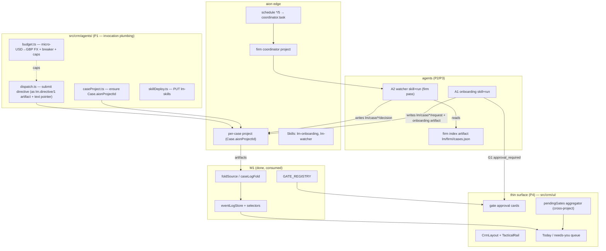

# Architecture: mesh-m2-watcher-onboarding

## TL;DR
- M2 is the first milestone that **does work and shows it**: the **A2 watcher** (a firm-level scheduled run that reads case state and proposes the next step), the **A1 onboarding agent** (builds the doc checklist, drafts the welcome/doc-request, gated by G1), and the **thin surface** — a `/crm` Today/needs-you queue + standalone gate-approval cards — rendered from M1's frozen `GATE_REGISTRY` and fold selectors.
- **The micro-portal ([EXT] hosted upload infra) is SPLIT OUT to a later milestone (M-portal).** Rationale: it's a web-deployment lift of a different kind, and spec §8.4 already fixes v1 client sends as *adviser-manual, logged* — so M2 onboarding drafts the request and the adviser sends it. M2 stays fully in-app and installable/experienceable. This is the deliberate scope call the brief asked for.
- Agents ride the **generic** aion plane (projects/commands/skills/schedules/artifacts); the lendmind typing (`lm.directive/1`, `lm.caselog/1`) is layered *inside* the free `text`/artifact fields. Nothing in `src/api/aion/v1/**` is modified.
- Every agent run writes `lm/case/<caseId>/…` artifacts that **M1's fold already ingests** — M2 produces the events, M1 consumes them. That seam is done and proven.
- The watcher in M2 **proposes** (writes `lm.watcher.decision` entries + raises worklist items + proposes G7 stage transitions); it does not yet dispatch live child agents (docintel/sourcing don't exist until M3+). "Stage-aware orchestration v1" = watch, detect, propose.

## Inputs
- Recon: none new (project-level `.lm-flow/recon/eigent-codebase-map.md` + `.lm-flow/recon/f02-ui-conventions.md`, both current)
- Brief: spec v2 §§4 (A1/A2), §12 M2, panel synthesis verdict #7 (thin surface ships with first agents), verdicts #4 (G4a/G4b), #10 (migration/supervision)
- Constraints: base `lendmind-crm` (never `main`); no new deps; `src/api/aion/v1/**` frozen; consume M1 (`agentContracts` + `fold` + `eventLogStore`) — do not modify M1's frozen contracts; every CI gate green (design-token, i18n parity, vitest baseline, license headers); GitHub issues disabled → tasks.md-as-queue

## Component diagram

## Components

### dispatch.ts — the lendmind command seam
- **Responsibility:** submit an agent invocation carrying a typed `lm.directive/1`, since the wire has no directive field.
- **Lives at:** `src/crm/agents/dispatch.ts` (new).
- **Mirrors:** `aionChatBridge.ts#startAionTask` → `session.submitCommand`. Publishes the directive as an `lm.directive/1` **artifact** (via `uploadAttachment`), passes its id in `attachment_ids`, and puts a short human-readable instruction + the directive's `directiveIdentity` in `text`. Browser flags OFF for A1/A2 (no browser use until M4).
- **Depends on:** `agentContracts/envelope` (encode/identity), `transport.submitCommand`, `caseProject.ts`, `budget.ts`.
- **Surface:** `dispatchDirective(envelope): Promise<{commandId, runId, directiveArtifactId}>`. Maps the two idempotency identities (`command_id` ↔ `directiveIdentity`) at this one call site.

### caseProject.ts — case ↔ aion project binding
- **Responsibility:** ensure a `Case` has an `aionProjectId` (M1 added the optional field); mint/bind on first agent need.
- **Lives at:** `src/crm/agents/caseProject.ts` (new).
- **Mirrors:** `aionChatBridge.ts#ensureBinding` (project creation/lookup). Writes the id back through the M1 outbox as a `case-upsert` (LWW) so it round-trips to the canonical log.
- **Surface:** `ensureCaseProject(caseId): Promise<string /*projectId*/>`, `firmCoordinatorProject(firmId): Promise<string>`.

### budget.ts — FX + breaker + caps
- **Responsibility:** close the micro-USD (edge spend) ↔ micro-GBP (firm caps) gap the explorers flagged; enforce the breaker (12/case/hr) and per-pass/per-case budgets.
- **Lives at:** `src/crm/agents/budget.ts` (new).
- **Mirrors:** reads `run.consumption.cost.costMicroUSD` (reducer terminal event) and/or `aionUsageStore` settled spend; converts with a firm-config FX rate (new `FirmConfig.fxUsdPerGbpMicro` — additive optional, defaulted).
- **Surface:** `withinBudget(caseId, kind): {ok:true} | {ok:false, reason}`, `recordSpend(runId, microUsd)`, `breakerTrip(caseId): boolean`. Supervision metrics (trips, per-pass spend, sampling) exposed as selectors for the surface.

### skillDeploy.ts + resources/lm-skills/
- **Responsibility:** author and deploy the two agent skills.
- **Lives at:** `resources/lm-skills/lm-onboarding/SKILL.md`, `resources/lm-skills/lm-watcher/SKILL.md` (+ reference bodies); `src/crm/agents/skillDeploy.ts` (new).
- **Mirrors:** `aionSkillsStore.putAionSkill` (PUT /skills, PascalCase document, no Idempotency-Key). Generalise `electron/main/index.ts#getExampleSkillsSourceDir` to also scan `resources/lm-skills` (one additive line) OR deploy directly via `putAionSkill` at setup — **decision: PUT directly** (avoids touching electron bundling; the skill docs live in-repo and deploy on first firm setup). Non-prompt fields (model/mcp) come back in `ignored_fields` — ignored by design.
- **Surface:** `deployLendmindSkills(): Promise<PutSkillResult[]>`.

### A1 — onboarding agent
- **Responsibility:** on case creation, build the doc checklist per case type, draft the welcome + doc-request message (embeds disclosure refs from firm config), prepare next actions.
- **Lives at:** the skill `resources/lm-skills/lm-onboarding/`; the desktop trigger in `src/crm/agents/onboarding.ts`.
- **Gate G1 (mandatory):** the outbound send is approval-gated — `approval_required` surfaces as a gate card; the message embeds initial disclosure (MCOB 4.4A) from firm config, never generated per-send. v1 send = adviser sends manually, logged.
- **Writes:** `lm/case/<caseId>/…` entries (`checklist-status`, `stream-entry`, `activity`) + an `lm.onboarding.request/1` artifact (already has a decoder in M1's `artifactKinds`).

### A2 — watcher
- **Responsibility:** a firm-level pass every 5 min that reads each active case's state and proposes the next step.
- **Lives at:** the skill `resources/lm-skills/lm-watcher/`; schedule registration in `src/crm/agents/watcher.ts`.
- **Mechanism (resolves the schedule constraint):** one **firm coordinator project** + a schedule `*/5 * * * *` whose `task` is a watcher entry directive. The fired run reads the **firm index artifact** (`lm/firm/<firmId>/cases.json`: active cases + projectId + stage + log head), applies a **pre-LLM no-change fast path** (skip cases whose log head is unchanged since last pass), and for actionable cases writes `lm.watcher.decision/1` + raises worklist items + proposes G7 transitions. **M2 scope: watcher PROPOSES; it does not dispatch live child agents** (docintel/sourcing arrive M3+). Breaker + budgets enforced via `budget.ts`. Supervision metrics written each pass.
- **Writes:** `lm/case/<caseId>/…` decision entries, `lm/firm/<firmId>/watcher-pass/*` supervision records.

### Thin surface — src/crm/ui/
- **Responsibility:** the minimum window — Today/needs-you queue + gate approval cards. First mortgage UI.
- **Lives at:** `src/crm/ui/CrmLayout.tsx`, `TacticalRail.tsx`, `TodayQueue.tsx`, `GateCard.tsx`, `tones.ts`, `primitives/` (PipelineBadge, StatusPill, CompletenessRing); route in `src/routers/index.tsx` (`/crm`, sibling to Layout, inside ProtectedRoute); i18n `src/i18n/locales/*/crm.json` (11 locales); stories `src/stories/crm/*.stories.tsx`.
- **Mirrors:** rail = `ProjectPageSidebar`/`NavTab` structure + `PROJECT_SIDEBAR_FOLD_SPRING`; queue = `HomeHubListTable` + `HomeHubItemShell`/`HomeHubItemBody` with a CRM column-def + grid-track constant; tones = new `CrmTone` union (NOT extending `Tag`'s `UiTone`), stage ramp per f02 recon §3; gate card = reuse `ApprovalCard` where possible, else a `GateCard` built from `GATE_REGISTRY` (M1's SC-005 already proved a card renders from registry data alone).
- **The two-source queue (net-new glue):** the needs-you list merges (a) **persistent** items — worklist + fold-raised items from `eventLogStore` selectors (our data); and (b) **live** agent gate-approvals from per-project aion reducer state (`pendingApprovals` + `timeline`). There is no cross-project aggregator today → build `pendingGatesAggregator.ts` over the per-project `ProjectUIState`s of active cases' projects. Gate cards need a resolved `decision` fed back from reducer state (the card waits for `approval_resolved`).

## Data model changes
No DB. Additive only:
- `FirmConfig.fxUsdPerGbpMicro?: number` (budget FX; defaulted in `FIRM_CONFIG_DEFAULTS`) — additive to M1's firmConfig (M1 contract is frozen for its existing fields; this is a new optional field, non-breaking).
- New artifact name convention `lm/firm/<firmId>/…` (index + supervision) — not a case log, not folded; read directly by the watcher and the supervision selectors.
- `crm-eventlog-store` unchanged (consumed read-only + via M1's `applyCaseFold`).
- New i18n namespace `crm` across 11 locales.

## External integrations
| Provider | Auth | We call | Events | Limits |
|---|---|---|---|---|
| aion edge (only) | existing bearer key | `submitCommand`, `uploadAttachment`, `createSchedule`/`updateSchedule`, `putSkill`/`setSkillStatus`, `loadAionArtifacts`/`readAionArtifact`/`subscribeAionArtifacts`, `getUsage` | `run_*`, `artifact_created`, `approval_required`/`approval_resolved` via existing SSE | attachment ≤3 MiB (no Idempotency-Key); skill PUT ≤8 MiB/file, ≤64 MiB total, If-Match concurrency; schedule create needs Idempotency-Key; cron exactly 5 fields |

No third-party integrations in M2 (micro-portal + lender portals are later).

## Sync vs async boundary
- **Async:** all agent runs (fire-and-fold), schedule ticks (edge-side), skill deploy, artifact reads.
- **Sync:** queue rendering from persisted selectors; gate-card verdict submit (`respondToAionApproval` self-heals transport).
- **Scheduled:** the firm watcher (`*/5`), edge-fired.

## Failure modes & handling
| Mode | Handling |
|---|---|
| Watcher pass over-budget | breaker trips → queue for adviser; supervision record notes the trip (never silently drops work) |
| USD/GBP FX absent | `budget.ts` refuses to run agents rather than guess; raises a config worklist item |
| Directive artifact publish fails | typed failure; command not submitted; retried per problem rule |
| Agent writes malformed `lm.caselog` | M1 fold already quarantines it loudly (no M2 work needed) |
| Skill PUT If-Match conflict | re-fetch version, re-PUT; `changed:false` on identical body is success |
| Case has no aionProjectId | `ensureCaseProject` mints one before dispatch |
| Cross-project approval state stale | aggregator re-reads per-project state on subscription; card waits for `approval_resolved`, never optimistic |
| Schedule duplicate on retry | create uses Idempotency-Key (edge dedupes) |

## Test strategy
- **Unit (colocated + `test/unit/crm/`):** dispatch envelope→artifact→command mapping; budget FX + breaker; skill doc build/PUT shape; watcher fast-path skip logic; onboarding checklist build; G1 gate; the two-source queue merge; tone components; aggregator.
- **Skill-body evals (`e2e/*.eval.ts`, not gated):** A1 drafts scored for disclosure presence + no unapproved product claims; A2 pass over the c417/c392 fixtures produces the expected decisions (golden-path eval, house pattern).
- **UI:** storybook stories for every primitive + the queue + gate card (light-theme, a11y addon); a rendering-contract test importing only the barrel.
- **Gates:** all existing + `check:i18n` (new namespace parity), design-token (new UI), vitest baseline unmoved.

## Phasing

### Phase 1 — Invocation & skills plumbing (no UI, no agents yet)
- Goal: `dispatch.ts`, `caseProject.ts`, `budget.ts` (with FX seam), `skillDeploy.ts`, and the two `resources/lm-skills/` skill folders authored + deployable.
- Success criterion: a fixture directive round-trips (envelope → artifact → command → run → an `lm/case` entry the M1 fold ingests) in a test; budget FX + breaker unit-tested; skills PUT clean.

### Phase 2 — A1 onboarding + G1
- Goal: onboarding trigger builds the checklist + drafts the request from firm config, writes case-log entries + the onboarding artifact, and raises the G1 gate.
- Success criterion: seeding a new case produces a checklist + a gated draft; approving G1 logs the (manual) send; disclosure refs present; eval scores the draft green.

### Phase 3 — A2 watcher
- Goal: firm coordinator project + `*/5` schedule + the watcher entry run with the pre-LLM fast path, trigger matrix (propose-only), breaker, budgets, supervision metrics.
- Success criterion: a watcher pass over the golden fixtures skips unchanged cases, writes decisions + worklist items for actionable ones, respects the breaker, and records per-pass spend.

### Phase 4 — Thin surface
- Goal: `/crm` route + `CrmLayout` + `TacticalRail` + the Today/needs-you queue (two-source merge) + standalone gate cards + CRM tones/primitives + `crm` i18n + stories.
- Success criterion: launch the app, open `/crm`, see the needs-you queue populated from seeded state, approve a gate card end-to-end; all UI gates (design-token, i18n, storybook, a11y) green.

### Phase 5 — Polish, demo, gates
- Goal: a scripted demo (seed case → watcher pass → onboarding draft → gate card → approve), full CI gate run, baseline unmoved.
- Success criterion: demo runs; every gate green; PR into `lendmind-crm`.

## Open questions for the spec phase
1. Can an edge agent run submit commands to *sibling* projects? If yes, M3+ watcher can dispatch child agents directly; if no, dispatch routes through the desktop. M2 sidesteps this (watcher proposes only) — but the spec should record the finding for M3.
2. The firm index artifact (`lm/firm/<firmId>/cases.json`) — who maintains it (onboarding appends; edits update)? Concurrency if two runs touch it. Recommend: append-only per-case pointer entries, watcher reads latest.
3. FX rate source — static firm-config value vs a fetched rate. Recommend static config for v1 (audit-stable), flagged for revisit.
4. Does the `/crm` surface reuse `ApprovalCard` verbatim or a purpose-built `GateCard`? Decide in spec after a spike (recon says reuse is viable; gate ergonomics — tier/SLA/batch from G4b — may need the bespoke card).
5. Coordinator-project lifecycle — one per firm, created at setup; where its id is stored (firm config artifact).

## Evidence
- Architecture reconciled against two 2026-08-22 codebase reports (UI-surface seams; agent-invocation + skills + schedules + usage seams) and `.lm-flow/recon/f02-ui-conventions.md`.
- M1 consumables confirmed on `lendmind-crm`: `src/crm/agentContracts/` (envelope/caseLog/gates/artifactKinds/firmConfig/reasonCodes) + `src/crm/fold/` (foldSource/caseLogFold/eventLogStore/outbox) with the documented public surface.
- Key seam decisions from the reports: directive rides as an artifact (no wire field); firm-level schedule = coordinator project + internal fan-out; budget needs USD→GBP FX; `resources/lm-skills/` deployed via direct PUT; needs-you queue bridges persistent (eventLogStore) + live (per-project reducer) approval state.
